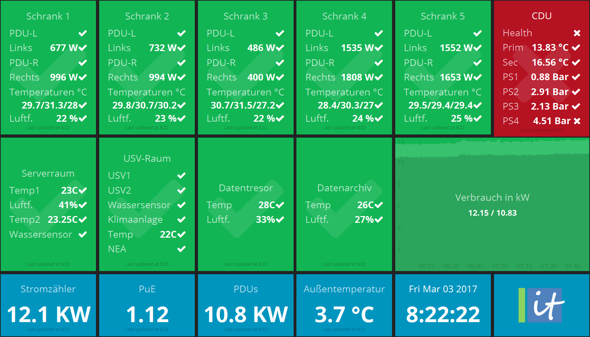

# Dashing with Icinga 2

#### Table of Contents

1. [Introduction](#introduction)
3. [License](#license)
4. [Requirements](#requirements)
4. [Installation](#installation)
5. [Configuration](#configuration)
6. [Run](#run)
7. [Thanks](#thanks)
8. [Troubleshooting](#troubleshooting)
9. [Development](#development)

## Introduction

[Dashing](http://shopify.github.io/dashing/) is a Sinatra based framework
that lets you build beautiful dashboards.

The Icinga 2 dashboard uses the Icinga 2 API to
visualize what's going on with your monitoring.

It combines several popular widgets and provides
development instructions for your own implementation.

The dashboard also allows to embed the Icinga Web 2 host and
service problem lists as iframe.




## License

* Dashing is licensed under the [MIT license](https://github.com/Shopify/dashing/blob/master/MIT-LICENSE).
* Icinga specific jobs and dashboards are licensed under the GPLv2+ license.

## Requirements

* Ruby, Gems and Bundler
* Dashing Gem
* Icinga 2 (v2.6+) and the REST API

## Installation

Either clone this repository from GitHub or download the tarball.

### Linux

Debian/Ubuntu:

```
apt-get update
apt-get -y install ruby ruby-dev build-essential nodejs
```

Proceed with the `bundler` and `dashing` gem installation .

```
gem install bundler
gem install dashing
```

Install the dependencies using Bundler.

```
cd /opt/dashing-icinga2
install --system
```

Proceed to the [configuration](#configuration) section.


## Configuration

### Icinga 2 API

The Icinga 2 API requires either basic auth or client certificates for authentication.

Therefore add a new ApiUser object to your Icinga 2 configuration:

```
vim /etc/icinga2/conf.d/api-users.conf

object ApiUser "dashing" {
  password = "icinga2ondashingr0xx"
  permissions = [ "status/query", "objects/query/*" ]
}
```

Set the [ApiUser permissions](http://docs.icinga.com/icinga2/latest/doc/module/icinga2/chapter/icinga2-api#icinga2-api-permissions)
according to your needs. By default the Icinga 2 job will fetch
data from the `/v1/status` and `/v1/objects` endpoints, but does not require write
permissions. If you're extending the API queries on your own, keep in mind to add
proper permissions.

In case you want to use client certificates, set the `client_cn` accordingly.

### Dashing Configuration


## Run

You can start dashing as daemon by using this script:

```
./restart-dashing
```

Additional options are available through `./restart-dashing -h`.

Navigate to [http://localhost:8005](http://localhost:8005)
